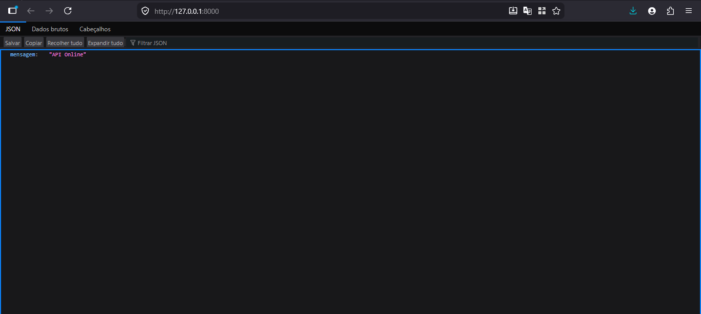
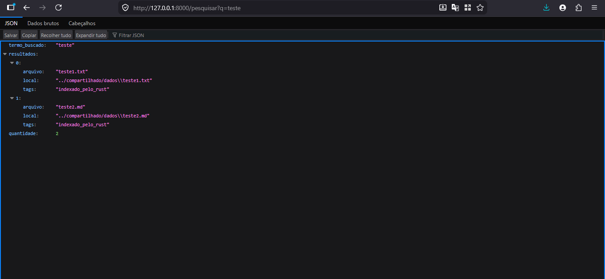

# 🇺🇸 English

# 🔎 Hybrid Search Engine: Rust & Python

This project is a High-Performance Search Engine designed to index and search for terms within text files located in specific directories. The project utilizes a hybrid architecture to extract the best of two worlds: Rust's speed for heavy processing and Python's versatility for the network interface.

## 🚀 Project Architecture

The system is divided into two main parts that communicate through a shared index file:

1.  **Core (Rust):** A performance-focused "heavy lifter.

    *   **Scanning:** Recursively explores directories using the `walkdir` library.
    *   **Indexing:** Reads `.txt` and `.md` files, cleans special characters, and creates an efficient **Inverted Index**.
    *   **Exporting:** Saves the word mapping into a formatted `index.json` file.
2.  **API (Python + FastAPI):** The user access layer.
    *   Consumes the JSON file generated by the Rust engine.
    *   Provides instant search endpoints filtering the processed data.
    *   Offers interactive documentation via Swagger UI.

---

## 🛠️ Technologies Used

*   **Languages:** Rust and Python.
*   **Web Framework:** FastAPI (Python).
*   **Rust Libraries:** `walkdir` (scanning), `serde_json` (JSON), `tokio` (asynchronous runtime for Rust).

---

## 📂 Folder Structure
```text
/CRAWLER
├── /compartilhado
│   ├── /dados       # Place your .txt and .md files here
│   └── /saida       # Where Rust will save index.json
├── /motor-busca     # Rust source code
└── /api             # Python source code (FastAPI)
```

##  🖥️ Operation Demo

### 1. API Online
*   When starting the FastAPI server, the root endpoint confirms the service is running.


### 2. dpoint Structure
*   The search is performed via the q parameter in the URL, allowing for dynamic queries.


### 3. Search Results
*  The system returns a detailed JSON containing the filename, local path, and the number of occurrences found by the Rust engine.


## 🚀 How to run the project locally

### Step 1: Generate the Index (Rust)
*   Ensure you have Rust installed. Navigate to the `motor-busca` folder and run:
    
- `cargo run`

*   This will process the files in `/compartilhado/dados` and create the `index.json` file in the output folder.

### Step 2: Start the API (Python)

*   Navigate to the `api` folder. Create a virtual environment and install the dependencies:

- `python -m venv .venv`

*   Activate the venv and install:
- `pip install fastapi uvicorn`

*   Start the server:
- `python -m uvicorn app.main:app --reload`

### Step 3: Perform Searches

Open your browser and use the search endpoint:
- `http://127.0.0.1:8000/pesquisar?q=YOUR_TERM`

### 📝 Final Notes

This project was developed as a technical challenge to explore language interoperability. The main focus was learning how to manage background processes (with the Rust engine preparing the data) and system integration via shared files, ensuring the frontend/API receives consumption-ready information without overloading the Python server.

Developed by: [Emanoel Lima](https://github.com//EmanoelLimaaa) & [Ramon Leandro](https://github.com/Ramon-Leandro)

# 🇧🇷 Português

# 🔎 Motor de Busca Híbrido: Rust & Python

Este projeto é um **Motor de Busca de Alta Performance** desenvolvido para indexar e buscar termos dentro de arquivos de texto localizados em diretórios específicos. O projeto utiliza uma arquitetura híbrida para extrair o melhor de duas linguagens: a velocidade do **Rust** para processamento pesado e a versatilidade do **Python** para a interface de rede.

## 🚀 Arquitetura do Projeto

O sistema é dividido em duas partes principais que se comunicam através de um arquivo de índice compartilhado:

1.  **Core (Rust):** Um "trabalhador pesado" focado em performance.
    *   **Varredura:** Explora diretórios de forma recursiva utilizando a biblioteca `walkdir`.
    *   **Indexação:** Lê arquivos `.txt` e `.md`, limpa os caracteres especiais e cria um **Índice Invertido** eficiente.
    *   **Exportação:** Salva o mapeamento de palavras em um arquivo `index.json` formatado.
2.  **API (Python + FastAPI):** A camada de acesso ao usuário.
    *   Consome o arquivo JSON gerado pelo motor em Rust.
    *   Exponibiliza endpoints de busca instantânea filtrando os dados processados.
    *   Fornece documentação interativa via Swagger UI.

---

## 🛠️ Tecnologias Utilizadas

*   **Linguagens:** Rust e Python.
*   **Framework Web:** FastAPI (Python).
*   **Bibliotecas Rust:** `walkdir` (varredura), `serde_json` (JSON), `tokio` (runtime assíncrono para Rust).

---

## 📂 Estrutura de Pastas
```text
/CRAWLER
├── /compartilhado
│   ├── /dados       # Coloque seus arquivos .txt e .md aqui
│   └── /saida       # Onde o Rust salvará o index.json
├── /motor-busca     # Código fonte em Rust
└── /api             # Código fonte em Python (FastAPI)
```

##  🖥️ Demonstração do Funcionamento

### 1. API Online
*   Ao iniciar o servidor FastAPI, o endpoint raiz confirma que o serviço está rodando.


### 2. Estrutura do Endpoint
*   A busca é realizada através do parâmetro q na URL, permitindo pesquisas dinâmicas.


### 3. Resultados de Busca
*  O sistema retorna um JSON detalhado contendo o nome do arquivo, o caminho local e a quantidade de ocorrências encontradas pelo motor Rust.


## 🚀 Como rodar o projeto localmente

### Passo 1: Gerar o Índice (Rust)
*   Certifique-se de ter o Rust instalado. Navegue até a pasta motor-busca e execute:
    
- `cargo run`

*   Isso processará os arquivos em `/compartilhado/dados` e criará o arquivo `index.json` na pasta de saída.

### Passo 2: Iniciar a API (Python)

*   Navegue até a pasta api. Crie um ambiente virtual e instale as dependências:

- `python -m venv .venv`

*   Ative o venv e instale:
- `pip install fastapi uvicorn`

*   Inicie o servidor:
- `python -m uvicorn app.main:app --reload`

### Passo 3: Realizar Buscas

Abra o navegador e utilize o endpoint de pesquisa:
- `http://127.0.0.1:8000/pesquisar?q=SEU_TERMO`

### 📝 Notas Finais

Este projeto foi desenvolvido como um desafio técnico para explorar a interoperabilidade entre linguagens. O foco principal foi aprender a gerenciar processos de background (com o motor em Rust preparando os dados) e a integração de sistemas via arquivos compartilhados, garantindo que o frontend/API receba informações prontas para o consumo sem sobrecarregar o servidor Python.

Desenvolvido por: [Emanoel Lima](https://github.com//EmanoelLimaaa) & [Ramon Leandro](https://github.com/Ramon-Leandro)
